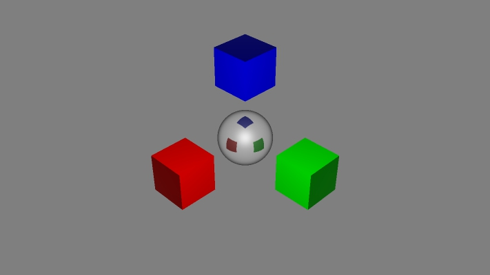

ray-tracer
==========

A simple 3D renderer based on ray-tracing algorithm.
For now, all computations are done on CPU, but future versions may leverage GPU computing power via OpenGL shaders.

## Currently implemented

- JPEG output
- Camera view matrix
- Basic scene data structure
- Ligthing:
  - Punctual lights
  - Area ligths
  - Diffuse lighting
  - Specular lighting
  - Intensity attenuates with distance
- Perfect refraction
- Perfect reflection
- Geometric objects:
  - Cube
  - Sphere
  - Plane
- Arbitrary rotation of objects
- Materials
- Adaptative oversampling

## TODO

- Textures
- More geometric figures
  - Pyramid
  - Cone
  - Cylinder
  - Dome (half-sphere)
  - Polygon
- Directed lighting
- Depth of field
- Bumpmaps

## Dependencies

- [`eigein` 3.2.1](http://eigen.tuxfamily.org/) for linear algebra data structures and operations
- [`libjpeg`](http://www.ijg.org/) for JPEG output

## Credits

Some algorithms were adapted from ["Algorithmes pour la synthèse d'images et l'animation 3D"](http://www.dunod.com/informatique-multimedia/graphisme-et-web-design/web-design-et-animation-web/algorithmes-pour-la-synthese-dimages-et-lani) by Rémy Malgouyres.
